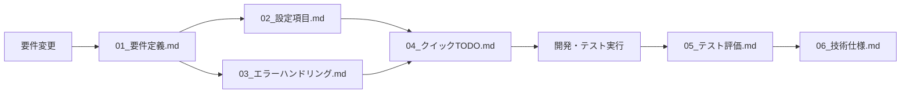

# プロジェクト要件・設計ドキュメント一覧

OcrSnippingAppプロジェクトの全ドキュメントを責任分担別に整理しています。

## 📋 ドキュメント構成

| カテゴリ | ファイル名 | 責任 | 概要 |
|----------|-----------|------|------|
| **要件定義** | [01_要件定義.md](./01_要件定義.md) | PM/BA | 機能要件・非機能要件・受入基準 |
| **設計** | [02_設定項目.md](./02_設定項目.md) | アーキテクト | 設定ファイル仕様・デフォルト値 |
| **エラー設計** | [03_エラーハンドリング.md](./03_エラーハンドリング.md) | アーキテクト | エラー分類・メッセージ設計 |
| **開発** | [04_クイックTODO.md](./04_クイックTODO.md) | 開発者 | 開発・テスト手順書 |
| **テスト** | [05_テスト評価.md](./05_テスト評価.md) | QA | 品質評価・パフォーマンス分析 |
| **技術** | [06_技術仕様.md](./06_技術仕様.md) | 開発者 | アーキテクチャ・API仕様 |

## 🔄 ドキュメント更新フロー

## 🎯 責任分担

### 📊 プロダクトマネージャー (PM/BA)
- **担当**: `01_要件定義.md`
- **責任**: ビジネス要件の定義・優先順位・受入基準
- **更新タイミング**: 仕様変更・新機能追加時

### 🏗️ アーキテクト
- **担当**: `02_設定項目.md`, `03_エラーハンドリング.md`
- **責任**: システム設計・非機能要件・エラー戦略
- **更新タイミング**: 設計変更・新規エラーパターン追加時

### 💻 開発者
- **担当**: `04_クイックTODO.md`, `06_技術仕様.md`
- **責任**: 実装・コード品質・技術仕様
- **更新タイミング**: 実装完了・API変更・新機能開発時

### 🧪 QA (品質保証)
- **担当**: `05_テスト評価.md`
- **責任**: テスト設計・品質評価・パフォーマンス分析
- **更新タイミング**: テスト実行後・リリース前・品質問題発生時

## 📝 更新ルール

### 必須更新シナリオ
1. **機能追加**: 01→02→03→04→06の順で更新
2. **バグ修正**: 該当ドキュメントのみ更新
3. **設定変更**: 02→04→05で検証・更新
4. **エラー追加**: 03→04→05で実装・検証

### レビュー要件
- **要件変更**: PMレビュー必須
- **設計変更**: アーキテクトレビュー必須
- **実装変更**: コードレビュー + ドキュメント更新
- **品質基準変更**: QAレビュー必須

## 🔍 クロスリファレンス

### 設定項目の追跡
- 定義: `02_設定項目.md`
- 実装: `06_技術仕様.md` (appsettings.json)
- テスト: `04_クイックTODO.md`
- 評価: `05_テスト評価.md`

### エラーハンドリングの追跡
- 分類: `03_エラーハンドリング.md`
- 実装: `06_技術仕様.md` (ErrorClassifier.cs)
- テスト: `04_クイックTODO.md` (トラブルシュート)
- 評価: `05_テスト評価.md` (エラー率)

### 受入基準の追跡
- 定義: `01_要件定義.md` (A-01～A-06)
- 手順: `04_クイックTODO.md`
- 結果: `05_テスト評価.md`

---

**最終更新**: 2025年11月3日  
**次回レビュー**: リリース前品質確認時
| **ユーティリティ** | [LogInspector](../tools/LogInspector/README.md) / [HotkeyProbe](../tools/HotkeyProbe/HotkeyProbe.ps1) | 開発者 | ログ解析・ホットキー衝突チェック用スクリプト |
